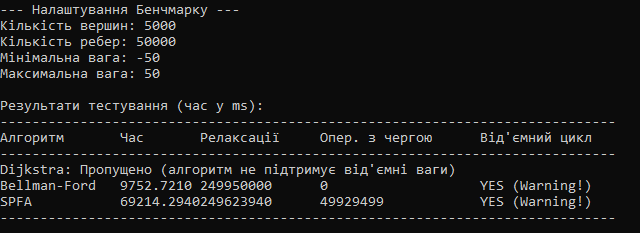
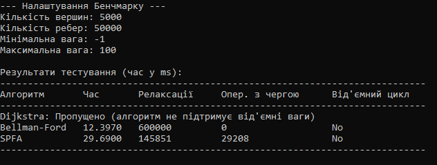
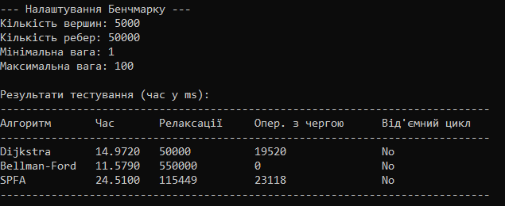
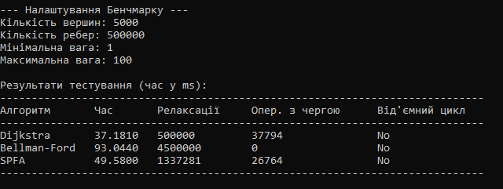

#  Оптимізація та аналіз алгоритмів роботи з графами: пошук найкоротших шляхів. (Дейкстра, Беллман-Форд, SPFA)

Курсова робота студента 25 групи Олефіра Романа. 

Полтавський політехнічний фаховий коледж, 2026 рік.

---

## 📌 Про проєкт
Ця курсова робота присвячена порівнянню трьох базових алгоритмів для знаходження найкоротших шляхів у зважених графах. Основна мета - це не тільки реалізувати алгоритми у коді, а з'ясувати, як топологія графа та кількість ребер впливають на реальну швидкість роботи (CPU time) та кількість операцій релаксації.

### По порівнюється:
* **Dijkstra (пріоритетна черга):** Оптимізована версія з використанням `std::priority_queue`. Найкращий вибір для графів без від'ємних ваг.
* **Bellman-Ford:** Класика для графів, де можуть зустрічатися від'ємні ребра. Додано перевірку на ранній вихід (якщо за ітерацію жодне ребро не оновилося).
* **SPFA (Shortest Path Faster Algorithm):** Покращений Беллман-Форд на черзі. Працює дуже швидко на розріджених графах, хоча в найгіршому випадку деградує.

---

## Результати тестів (Скріншот)

Тут можна побачити результати тестів із різними графами:

 

---

## Технічні деталі
**Метрики, які збирає програма:**
1.  **Час (мс):** Скільки реально виконувався алгоритм.
2.  **Релаксації:** Скільки разів спрацювала умова $d[v] > d[u] + w(u, v)$.
3.  **Операцій з чергою:** Накладні витрати на роботу з контейнерами (push/pop).
4.  **Від'ємний цикл:** Чи було виявлено цикл від'ємної ваги.

---

## Короткі висновки
* **Дейкстра** — найнадійніша, бо вона робить рівно стільки роботи, скільки потрібно, і не перевіряє одні й ті самі вузли по кілька разів.
* **Беллман-Форд** — повільний на великих даних ($O(V \cdot E)$), але незамінний, якщо треба відловлювати від'ємні цикли.
* **SPFA** — дуже нестабільний. На випадкових графах він часто обганяє навіть Дейкстру, але на спеціально підібраних структурах (типу граф у вигляді змійки) починає серйозно гальмувати.
